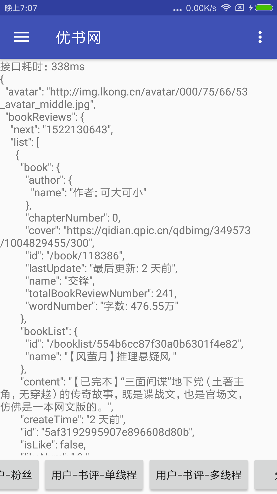

# 抓取优书网的html并快速解析为json格式的数据

#### 这个项目最初的想法是给一个小说网站写一个第三方客户端 ,  以一种优雅的方式 , 解析目标网站的html , 并转换为json格式的数据 , 然后跟正常的接口一样使用 

本项目网页解析的代码来自`java `爬虫项目 [webmagic](https://github.com/code4craft/webmagic)

1. 定义接口 , 注解方式指定解析器

   ```java
   /**
    * 获取用户的所有书评-单线程
    *
    * @param id userId
    */
   @Parser(UserParser.class)
   @GET("user/{id}/comments")
   Observable<Http<User>> getUserBookReview(@Path("id") String id);
      
   ```

2. 编写解析器

   要解析的网页地址 http://www.yousuu.com/user/756653/comments

   ```java
   @Override
   protected Http<User> convert(Html html) {
       Http<User> http = new Http<>();
       User user = new User();
       http.setData(user);

       //用戶信息
       user.setAvatar(html.xpath(xpath_icon).get());
       user.setName(html.xpath(xpath_user_name).get());
       user.setSignature(html.xpath(xpath_signature).get());
       user.setFollowBookListNum(html.xpath(xpath_follow_book_list_num).get());
       user.setFansNum(html.xpath(xpath_fans_num).get());
       user.setFollowNum(html.xpath(xpath_follow_num).get());

       String s = html.xpath(xpath_active_tab).get();
       if (!TextUtils.isEmpty(s)) {
           switch (s) {
               case "动态":
                   user.setBookReviews(new BookReviewParser().parserBookReviewList(html));
                   break;
               case "积分":

                   break;
               case "书单":
                   user.setBookList(new BookListParser().parserBookList(html));
                   break;
               case "粉丝":
                   user.setFans(new FollowedUserParser().parserUser(html));
                   break;
               case "关注书单":
                   user.setFollowBookList(new BookListParser().parserBookList(html));
                   break;
               case "关注":
                   user.setFollowUser(new FollowedUserParser().parserUser(html));
                   break;
           }
       }
       return http;
   }

   ```

   `xpath` 规则都是通过 `Chrome`浏览器 开发者控制台 , 选中对应的标签后,右键 `Copy -> Copy Xpath ` ,然后稍微修改得来的

   完整代码[UserParser.java](https://github.com/lll-01/YouShu/blob/master/app/src/main/java/com/erlei/youshu/parser/UserParser.java)

3. 发起请求

   ```java
   add(Api.getInstance()
           .getUserBookReview(userId)
           .compose(TransformerUtil.observableIoMain())
           .subscribeWith(new SimpleObserver<Http<User>>() {
               @Override
               public void onSuccess(Http<User> o) {
                   super.onSuccess(o);
                   getView().getUserBookReview(o.getData());
               }
           }));
   ```

   ​

#### 单线程与多线程解析速度对比

<div align="center">



</div>

```
HTML 文件大小 1.48M 左右
运行 10 次
手机 : 小米6
(不包含下载html的时间)
单线程解析 : 平均耗时 466ms
多线程解析 : 平均耗时 206ms
```


#### 仅限学习交流使用 , 如有侵权 请联系我删除

